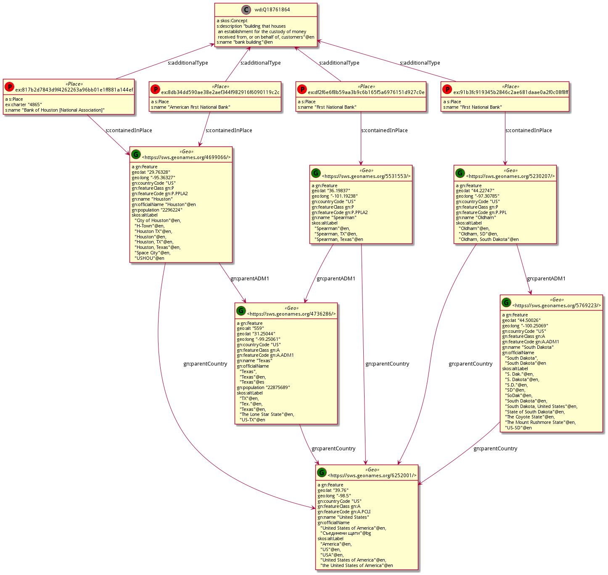

# Ontotext Reconciliaiton use case

## Overview

This use case covers a typical reconciliation scenario.
The aim is to augment an existing (target) RDF Knowledge Graph with additional data coming  
from a non-semantic (tabular) source.

The tabular source contains information about entities already present in the KG 
as well as about and new entities.   
The entities present in the KG should be first matched, 
while those not present should be created. 

In order to match the entities one must rely on information with different levels of ambiguity. 
This can be:
* shared identifiers: unambiguous but often limited in coverage
* same labels: ambiguous and one should rely on additional contextual information
* similar labels: often entities between the source and the target do not share exact labels but similar ones. In such a case a measure of string similarity is needed in addition ot the contextual information. 

## The Knowledge Graph  

The Knowledge Graph contains the following entities
* The administrative territorial hierarchy of the world. All the countries and their administrative divisions from geonames (451379 entities)
* Populated places for Europe and North America. (888968 entities) 
* Alternative labels in english for the locations (harvested from wikidata)
* Buildings from wikidata with their location (244779 entities)
* Part of the banks entities in the tabular data with their locations (609 entities)

This diagram shows how places are attached to their corresponding feature from Geonames 
as well as the relevant part of the administrative hierarchy needed to solve the reconciliation case.

More information on the KG with links to the data 
and the building procedure are available in the [kb](data/kb) folder

## Tabular data and reconciliaiton workflow

The tabular data is in [national-bank.tsv](data/tabular/national-bank.tsv)
Each line contains information about one bank in the US.

The reconciliation process has roughly three stages

### Match using shared identifiers

Reconcile the unambiguous entities using their shared identifiers. 
In this case this is the `CHARTER NO` column 
and the value of the `ex:charter` relation for about 100 entities

### Match using string matching 

For the rest of the entities we can not rely on shared identifiers, 
but only on string matching between the labels.
Given that labels aren't unique, we must rely on some element of their context in order to disambiguate.
Here this is the geographic location. 

### Create and add new entities 
Some entities from the tabular data are not present in the KG. 
They should be created 

## Ontotext Reconciliation configuration

## Workflow

