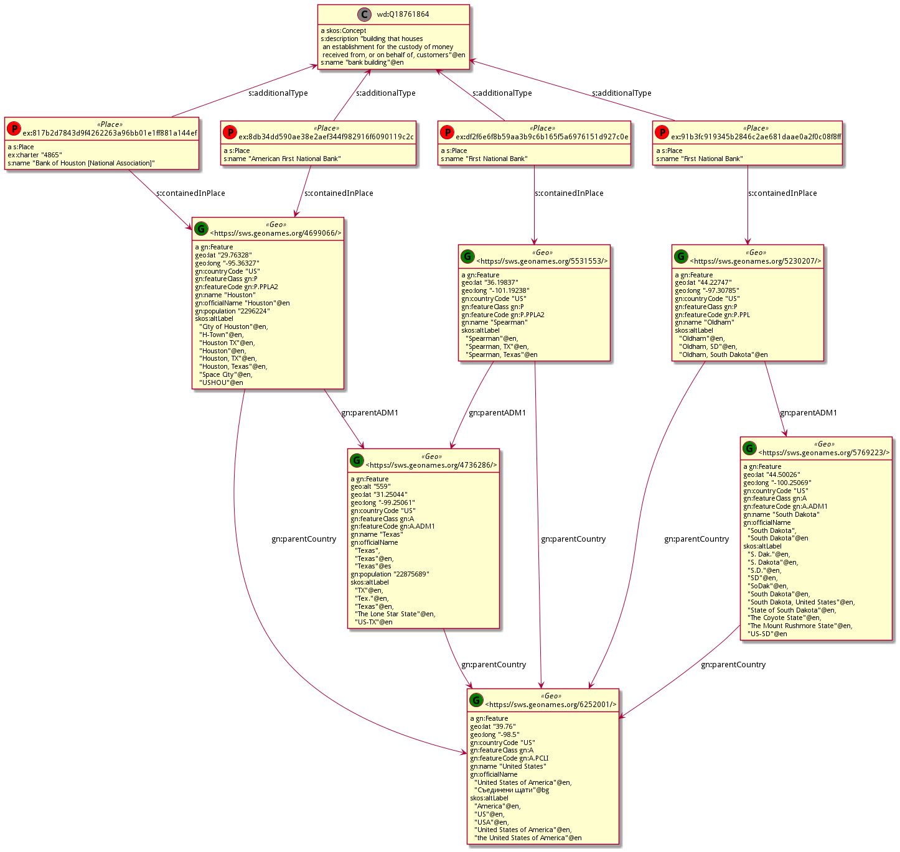
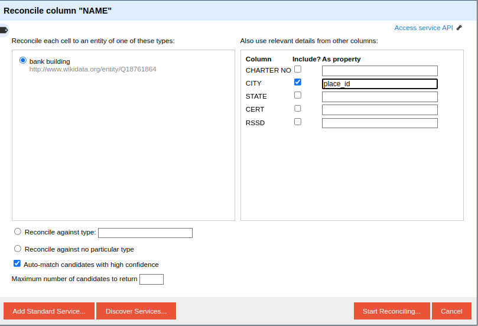

# US Banks reconciliation use case

## Overview

This use case covers a typical moderately complex reconciliation scenario. 
The aim is to augment an existing (target) RDF Knowledge Graph with additional data coming from a non-semantic (tabular) source.

The tabular source contains information about entities already present in the KG 
as well as about and new entities. 
In this particular case these are banks located in US cities.
Not all the entities are present in the KG. 
So th two datasets should first be matched, 
and then the entities not present in the KG created. 

In order to match the entities one must rely on information with different levels of ambiguity. 
This can be:
* shared identifiers: unambiguous but often limited in coverage
* same labels: ambiguous and one should rely on additional contextual information
* similar labels: often entities between the source and the target do not share exact labels but similar ones. In such a case a measure of string similarity is needed in addition ot the contextual information. 

## The Knowledge Graph  

The Knowledge Graph contains the following entities
* The administrative territorial hierarchy of the world. All the countries and their administrative divisions from geonames (451379 entities)
* Populated places for Europe and North America. (888968 entities) 
* Alternative labels in english for the landmarks (harvested from wikidata)
* Landmarks with their name and location (245388 entities). Close to 600 of these landmarks are bank buildings and have corresponding matches in the tabular data.  

This diagram shows how places are attached to their corresponding feature from Geonames 
as well as the relevant part of the administrative hierarchy needed to solve the reconciliation case.



More information on the KG with links to the data 
and the building procedure are available in the [kb](data/kb) folder

## Tabular data 

The tabular data is in [national-bank.tsv](data/tabular/national-bank.tsv)
Each line contains information about one bank in the US. 
* Most but not all of them have matches in the Knowledge Graph
* The names are highly ambiguous (18 entities are called "First National Bank")
* They are unambiguous w.r.t their location. I.e. each Bank is in a different city and state.
* Locations are a place and US state, where the state is identified by a two-letter code.

```tsv
ID        NAME	                  CITY	          STATE	  CERT	  RSSD
18609     First National Bank     Spearman        TX      26219   266066
21793     First National Bank     Oldham          SD      25894   944355
10004     First National Bank     Paragould       AR      3887    42448
3105      First National Bank     Waverly         IA      4519    376442
10465     First National Bank     Cloverdale      IN      4324    60648
```
## Reconciliation service

### Public service

Instances of the reconciliation services
described here currently run at:
* <https://recon-demo.ontotext.com/places>
* <https://recon-demo.ontotext.com/landmarks>

### Local Service Configuration

These are instructions how to run the service locally.
The configuration files are in the [config](config) folder.

1. Obtain a valid Ontotext GraphDB SE licence and add it in this project at `config/gdb/graphdb.license` 
2. Start the reconciliation service docker `docker-compose -f docker-compose.yml up -d`
3. Access GraphDB at `localhost:7400` 
4. Load the RDF data from [us-banks-recon-kb.ttl.zip](data/kb/us-banks-recon-kb.ttl.zip). N.B the file is tracked using [git-lfs](https://git-lfs.com/). 
5. Create the elasticsearch connectors by executing the two SPARQL queries [landmarks.sparql](config/reconciliator/landmarks.sparql) and [place.sparql](config/reconciliator/places.sparql) 

## Matching workflow using Ontotext Refine

Download and run latest [Ontotext Refine](https://www.ontotext.com/products/ontotext-refine/).

Create a project using the tabular data from [data/tabular/national-bank.tsv]

Register the reconciliation endpoints.
* `http://localhost:8085/places` - for the Geonames entities 
* `http://localhost:8085/landmarks` - for the landmarks 

First match the geographical entities using the `places` reconciliation endpoint: 

Matching  the `CITY` column alone will be ambiguous,
due to the high number of cities with the same name.
For this reason add details from another column, "STATE", which should match with the content of the `parent1` field, 
which contains the alternative labels of all the administrative entities of level 1. 


Once the process is finished we can match the banks against the `landmarks` endpoint. 
To do this match the 'NAME' column and add the details from the 'CITY' column as the `place_id` field.
Note that the type suggestion service correctly identifies "bank building" as the correct type.



## Different stages of the reconciliation process

The reconciliation process has roughly three stages,
corresponding to different levels of overlap,
starting from th less ambiguous to the more ambiguous

### Match using shared identifiers

Reconcile the unambiguous entities using their shared identifiers.
In this case this is the `CHARTER NO` column
and the value of the `ex:charter` relation for about 100 entities

_This is currently not part of the service_

### Match using string matching

For the rest of the entities we can not rely on shared identifiers,
but only on string matching between the labels.
Given that labels aren't unique, we must rely on some element of their context in order to disambiguate.
Here this is the geographic location.
First need to match the `STATE` column to entities corresponding to US states, using the `skos:altLabels`.

This query selects all the US states and their alt labels
```sparql
PREFIX gn: <http://www.geonames.org/ontology#>
PREFIX skos: <http://www.w3.org/2004/02/skos/core#>
PREFIX gn: <http://www.geonames.org/ontology#>
select * where {
    ?s a gn:Feature ;
    gn:name ?name ;
    skos:altLabel ?altLabel ;
    gn:featureCode <https://www.geonames.org/ontology#A.ADM1> ;
    gn:countryCode "US" .
}
```

Then we need to match the `CITY` column to `gn:Features` of gn:featureClass "P" (populated place),
which are located in the corresponding state.

This query matches all the cities in Texas

```sparql
PREFIX skos: <http://www.w3.org/2004/02/skos/core#>
PREFIX gn: <http://www.geonames.org/ontology#>
select * where {
    ?s a gn:Feature ;
    gn:name ?name ;
    skos:altLabel ?altLabel ;
    gn:featureClass <https://www.geonames.org/ontology#P> ;
    gn:parentADM1 <https://sws.geonames.org/4736286/> ; #Texas
    . 
}
```

Finally the `NAME` column should be matched against entities of type `s:Place` ;
located (`s:conatinedinPlace`) in the corresponding City.

This query selects all places in Houston.
```sparql
PREFIX s: <http://schema.org/>
PREFIX skos: <http://www.w3.org/2004/02/skos/core#>
PREFIX gn: <http://www.geonames.org/ontology#>
select * where {
    ?s a s:Place ;
    s:name ?name ;
    s:containedInPlace <https://sws.geonames.org/4699066/> .
}
```

### WIP: Create and add new entities


Some entities from the tabular data are not present in the KG.
They should be created using Ontotext Refine
This is out of scope of the current version of Recon,
but it is good to have it in mind 

### Run

`sudo docker-compose -f docker-compose.yml up -d`

### Templates config 

README for now in [gitlab](https://gitlab.ontotext.com/graphdb-team/reconciliation/reconciliation-framework/-/tree/master/conciliator#mustache-templates)
